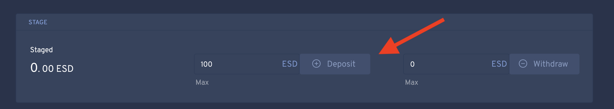

# Frequently Asked Questions about ESD

## Empty Set Døllar

### What is Empty Set Dollar? 

ESD is designed to be fully a decentralized self-stabilizing dollar.

###  How does ESD differ from other stablecoins?

A community member has written an article comparing and contrasting various approaches to stable coins. The TL:DR is:

> ESD is a stablecoin built to be the reserve currency of decentralised finance. ESD’s carefully balanced approach sidesteps the centralisation risk of USDC, USDT, & TUSD, avoids AMPL & BASED’s death spirals, the 100+ percent collateralisation requirements of sUSD & DAI, and, most importantly, it integrates perfectly with existing DeFi protocols.
>
> The ESD protocol expands on the pioneering work of Basis.io, which voluntarily shut down before launch due to regulatory pressure on the team. ESD has launched with an anonymous team to minimise pressure it may face down the road and the protocol includes a novel new mechanism in place of Basis’ seigniorage shares.

See the article here: https://medium.com/@lewisfreiberg/empty-set-dollar-esd-a0abbfc5ecdb

### Who created ESD?

The team is anonymous. 

However, if you'd like to contact them you can email them here: emptysetsquad@protonmail.com

### If ESD is a stablecoin, is it always worth $1?

No. The goal, at maturity, is to see the stablecoin stay very close to \$1.  However, it is expected in the early days of the project, it will be more volatile. Some volatility is natural -- the whole design of the protocol is to adjust the money supply when the price diverges -- consequently, it is not a surprise that it would diverge. And the fact that it was designed with a maximum award in one epoch of 1.1, indicates the designer felt like prices above $1.10 were to be expected.  So high volatility in the early days of the project is not necessarily a sign the protocol is not working.  However, over time it is expected for the volatility to subside and ESD to maintain its peg against the desired asset.

In a [medium](https://medium.com/@0xans/ess-a-brief-intro-towards-novel-elastic-stablecoin-implementation-607e86654a9f) post by an early community member of ESD he/she explains the mechanism.

### How ESD's supply grow in relation to token holders? 

ESD uses a seigniorage model to grow the money supply. This means, if the market demands more ESD (more buyers than sellers of ESD), more of the coin (ESD) will be minted to meet that demand and bring the price back down to $1.  That extra minted money supply is distributed to the current holders of ESD (who have taken steps to lock their holdings to the protocol, as detailed below.)  Keep in mind, if the reverse happens -- demand goes down -- the protocol has to reduce the supply of ESD, having an opposite effect.

### How does ESD become a sustainably useful token?

For ESD to become a sustainably useful stablecoin like USDT or DAI, it must begin to be accepted as currency by DeFi and other applications on the Ethereum protocol. In periods of volatility, the token's utility may be diminished. However, as the protocol matures the volatility will reduce increasing its utility. 

### I want to contribute to ESD’s success, what should I do?

Thank you for wanting to help make the project succeed. You can contribute to everyone’s benefit in many ways. Some clear ones:

- Take time to read the white paper and these docs to understand the implications of the protocol and how it can be applied to the DeFi ecosystem.
- Join the Discord group linked from the DAO to help answer questions & discuss governance issues. 
- Advocate for ESD to be added into other DeFi platforms

## Token Mechanics

### What is an epoch?

The length of time between adjustment to the money supply. Every epoch, currently 8 hours, the protocol assesses whether the money supply ought to grow or shrink, and then issues rewards or debt to make that happen. As an investor, at the end of every epoch you receive rewards if it expands.

### What is a coupon?

Coupon is the method used to shrink the money supply. Simply, the protocol offers an incentive for users to voluntarily burn their ESD in return for a coupon that can be redeemed when the money supply grows again, to regain their ESD along with a bonus for having bought the debt.

### What is staging?

### What is bonding?

### What do frozen and fluid states mean?

The best way to visualize this is with the flow below:

**Deposit/Withdraw ←→ Staged ←→ Bond/Unbond.**

- Any time, you use Bond or Unbond once, you go into a fluid state in that epoch
- Upon the next epoch, you will go back into the frozen state

**In fluid state:**

- You will not be able to withdraw or deposit
- You will be able to bond/unbond any number of times.

**In Frozen state:**

- You will be able to deposit and withdraw.

This means when you are bonded and want to withdraw, you will first unbond, spend the rest of the epoch in fluid state and upon next epoch when state changes to frozen, you will be able to withdraw.

For Deposit, you will be able to deposit and bond in the same epoch as when you deposit and stage you will still be in a frozen state, but as soon as you bond, you will be in a fluid state, so you cannot deposit again in that epoch, or withdraw.

Frozen and fluid states (also Locked) appear on the wallet page and the LP Reward Pool page of the DAO.  This terminology is a bit confusing, but you are basically allowed to interact with the DAO by bonding or unbonding ESD or LP just once per epoch.  Frozen and fluid tell you the state of your access to transacting with the DAO.  “Frozen” enables you to transact.  More state detail is discussed in the white paper.

### Should I advance an epoch? What does this mean?

Epochs happen every eight hours. For technical reasons, someone needs to manually trigger the start of a new epoch.  A number of users have written bots competing for the 100 ESD reward to be the first to trigger it, as a new user I would not worry about this technical detail.

### What does the governance page do and how should I engage with it?

Since ESD is owned by the users, there is a governance section for proposals to make changes. You need to own at least 1% of bonded DAO to make a new proposal. This again is probably something to engage in when you have already mastered the basics.

### Why do some epochs grant rewards and some epochs do not?

If there is excess demand for ESD, then the price will trend above \$1 on the Uniswap pool, and that signals the protocol to mint additional token supply. Conversely, if the demand shrinks, excess selling on Uniswap will push the price below $1, which triggers the protocol to generate debt and incentivise token holders to burn ESD to shrink the token supply.

If the money supply needs to be shrunk, no supply expansion will be made that epoch. If the money supply was shrunk in the past, those debts will either remain on the protocol, or get bought by users in the form of coupons. Both coupons and debt will be paid off in the future ahead of new rewards, so it is possible to receive no new rewards in a money supply expansion epoch if there are historical debts to be repaid first.

### How do we know if any given epoch will have rewards and how much rewards?

You can’t know for sure until right when the new epoch is triggered as the TWAP price is adjusted by the trading activity right up to the new Epoch. 

You can estimate the amount of rewards by looking at the Regulation page on the DAO and doing some calculations. However a community maintained website, called [ESD Tools](https://esd.tools/), that makes an estimate of what, if any, rewards can be expected in this epoch, but it is not perfect, only indicative.

## Maintaining ESD's price peg

### How do I participate in maintaining the peg?

In order to participate in maintaining the price peg for ESD you need to have tokens to either bond or provide liquidity with. 

### How do I buy ESD?

Currently the only place to buy ESD is the Uniswap ESD-USDC pool. For your safety, please access this pool by going to the Trade page of the ESD DAO site and clicking the trade button, which will take you to the pool: [here](https://emptyset.finance/#/trade/)

Because ESD has not been whitelisted at Uniswap, you have to approve the unknown token. Please understand, in these early days of ESD, the price can be very volatile. In recent bull runs, the price of ESD has gone up over \$1.50 per USDC, even though over time it should converge to $1. So pay attention to what price you are paying when you buy it. On the other hand, in these bull periods, returns can often hit 8% compounding per 8 hours, which if it held into the future could offset any premium paid. The future is inherently uncertain so you have to use your own judgment here.

### Do I gain rewards for buying ESD?

If you buy ESD on Uniswap but do nothing else, no. Your ESD is in a state called “circulating” and it just sits inert.

### What methods exist to receive ESD rewards?

There are three methods to generate rewards when holding ESD:

1. Take your ESD and bond it to the DAO (recommended for beginners)
2. Take your ESD and provide liquidity to the Uniswap LP pool, and bond those tokens to the DAO to receive liquidity rewards. 
3. Buy ESD debt coupons during periods the protocol goes into debt, and redeem them later when it goes into surplus

### How does bonding compare with providing liquidity?

The relative reward to bonding to the DAO, and providing liquidity in the Uniswap pool, vary somewhat. 80% of created new supply is awarded to those who bond to the DAO, and 20% to people who provide liquidity to the LP. Depending on the total amount in the Uniswap LP, those rewards can vary dramatically. Also, being a liquidity provider has its own risks including impermanent loss. 

A community member has created this information site: [ESD Tools](https://esd.tools/) which estimates the relative rewards  for the current epoch. Large token holders can move large sums in and out of the LP pool on Uniswap in between epochs and dramatically move the rewards distributed to the LP. 

Further, the rewards can change right up to the end of the epoch. So LP rewards are sometimes higher than the DAO, sometimes less, but are more volatile.

### As a beginner, how should I use my tokens to balance the peg?

Bonding your ESD to the DAO is very likely the best way to go. It is simple, and you can “set it and forget it”.

Entering the liquidity pool is more complicated -- you have to provide at uniswap, risk impermanent loss, stake the Uniswap token at the DAO. Most importantly, this method does not automatically add the reward into the LP pool -- each epoch you are granted rewards but they will just float, circulating, unless you take action every 8 hours to enter them (either re-providing them into the liquidity pool, or claiming them and staking them to the DAO). For these reasons, when getting started, bonding to the DAO is a good place.

Purchasing coupons also has risks -- you have to have a view on when the protocol will come out of debt, and if the protocol goes a month without coming out of contraction, your coupons could expire  -- so as a beginner coupons may not be for you.

### What are the exact steps to buy ESD from Uniswap and bond to the DAO?

1. Go to the Wallet page on the DAO site:  http://emptyset.finance/#/wallet/ 
2. Click on Trade button to go to Uniswap
3. Connect to Uniswap, and approve the tokens for trading

4. Enter an amount of USDC into Uniswap, approve the transaction and buy ESD. 
5. Pay attention to the price and slippage as the market's liquidity changes hourly.
6. Come back to the ESD DAO wallet page: http://emptyset.finance/#/wallet/
7. Click unlock to allow the DAO to interact with your ESD

8. Enter the number of ESD into the Staged Deposit box -- or click max -- then click the Deposit button and approve the transaction, wait for that transaction to complete on the Ethereum network.

8. Click Max to load the box next to the “bond” button and click bond. When that transaction clears, your ESD will be bonded to the DAO and begin earning rewards at the end of the epoch. 

>  **Note**: that once you initiate a bond during an epoch, you will not be able to deposit/withdraw thereafter during that epoch (until the next epoch resets), per below on Frozen/Fluid state.

### What are the exact steps to bond Uniswap LP pool tokens?

You should probably not do this unless you have experience with Uniswap LP staking. If you are comfortable with the processed the following:

1. Bond ESD & ESDC on Uniswap
2. Go to https://emptyset.finance/#/pool/
3. Click "Unlock", and wait for confirmation
4. Under the "Stage" section: Enter amount and click "Deposit", and wait for confirmation
5. Under the "Bond" section: Enter amount and click "Bond", and wait for confirmation

### What can I do with rewards from bonding to the DAO?

If you have bonded to the DAO, any awarded ESD are automatically bonded, so your rewards continue to compound automatically.

If you want to sell ESD, you must first unbond them from the DAO, and then unstage them. After you unbond, you need to wait until the subsequent epoch to unstage them. This delay of a full epoch to access your ESD is deliberate.

### What can I do with rewards from bonding Uniswap LP tokens?

After you are rewarded tokens for providing liquidity to the Uniswap pool, they will appear on the LP Reward Pool page of the DAO (http://emptyset.finance/#/pool/) under rewarded on the header. Those tokens, in that state, are circulating -- they are not generating further rewards. 

If you want to roll them into additional ownership of the Uniswap LP pool, you can do it easily with one click. On the bottom of the LP Reward Pool page, you see a “Provide” section. It will also display your USDC balance in your connected wallet. You can enter a number from your awarded tokens (or just click Max) into the box, and if you have sufficient USDC to contribute the necessary proportion demanded by the pool at that time, you will trigger a transaction by clicking provide that will take your rewarded ESD, and the appropriate amount of USDC, add it to the Uniswap pool, and stake the Uniswap LP token you receive in return to the DAO -- effectively increasing your ownership in the LP pool.

Alternatively, if you want to withdraw your awarded tokens or bond them to the DAO, you have to:

	1. Click 'Max' next to the Unbond button.
 	2. Click unbond and send the transaction
 	3. Once confirmed you should see the tokens move from "Rewarded" to "Claimable"
 	4. If you wish to re-bond your Uniswap LP tokens and continue to get rewards in the next epoch. Then click 'max' next to Bond, then send the Bond transaction
 	5. Wait 1 epoch
 	6. Click claim and then the tokens will be in your wallet

## Troubleshooting

### I am trying to do an action on the DAO site, such as deposit or bond, and the button stays grayed out or won’t work -- why might this happen?

Chances are, you already did a transaction in this epoch, and have to wait until the next epoch to interact again.  See above regarding frozen and fluid states.